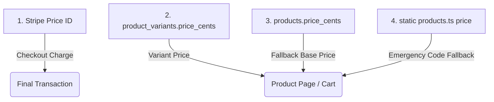
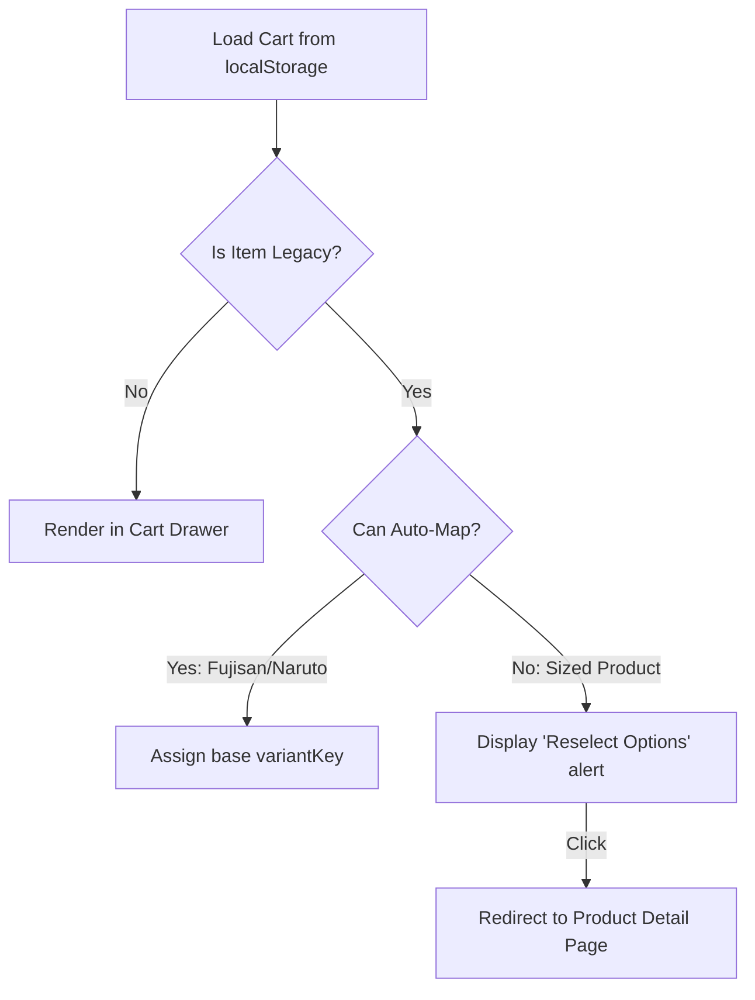

# Phased E-Commerce Implementation Plan: Product Variants & Bamboo Thinning

This document outlines a phased, safe, and robust strategy to implement structured product variants (size, style, handle) and add the new **Bamboo Thinning** product to the Katana Edge catalog. 

To maintain business continuity, the existing checkout flows for the flagship **Micro Slit** and **Fujisan** shears are preserved during the migration. All new configuration steps are scheduled in self-contained phases.

---

## 🔒 Scope Boundaries & Safety Rules

1. **Preserve Working Checkout**: Do not immediately replace the current Micro Slit and Fujisan checkout flow. Keep `STRIPE_MICROSLIT_PRICE_ID` and `STRIPE_FUJISAN_PRICE_ID` active as production fallbacks in `.env` and `src/lib/checkout-products.server.ts` until the new variant checkout is fully proven.
2. **Additive Migration**: All database changes are strictly additive. Do not rename, remove, or modify existing tables or columns. Keep all new order-item columns nullable.
3. **No Private Data Exposure**: Do not expose the complete `product_variants` table to the anonymous Supabase client. RLS must be enabled with no public SELECT policies. The client will query a public-safe view (`product_variants_public`) that excludes private operational fields (`stripe_product_id`, `stripe_price_id`, `sku`, `inventory_quantity`).
4. **Sandbox Testing**: No live Stripe configurations are modified first. All new variant checkout logic is created in a sandbox environment and verified on a Vercel preview deployment before merging to `main`.
5. **Developer-Controlled Writes**: Variant configuration, Stripe IDs, SKUs, inventory, and payment status remain developer-controlled in the database. The `SUPABASE_SERVICE_ROLE_KEY` must never be exposed to client-side code.

---

## 1. Confirmed Product Options

For all products with size options in inches, the variant option selector in the user interface must be labeled **Inches** (e.g., displaying options as plain numbers like `5.5`, `6.0` matching the product page design).

### 1. Micro Slit (Flagship)
- **Slug**: `micro-slit-shears`
- **Product Key**: `microslit`
- **Specification Options**:
  - **Inches**: `5.5`, `6.0`, `6.5`, `7.0`
- **Variant Keys**: `microslit_55`, `microslit_60`, `microslit_65`, `microslit_70`
- **UX**: Requires the customer to select an option under **Inches** on the product detail page before "Add to Cart" is enabled.

### 2. Fujisan (Flagship Blending)
- **Slug**: `fujisan-thinning-shears`
- **Product Key**: `fujisan`
- **Options**: **No options** (no size, handle, or style selectors).
- **UX**: No visible selectors. Purchases continue using the legacy checkout flow to minimize risk.

### 3. Thunder
- **Slug**: `thunder-shears`
- **Product Key**: `thunder`
- **Specification Options**:
  - **Inches**: `5.8`, `6.25` *(Do not round 6.25 to 6.3)*
- **Variant Keys**: `thunder_58`, `thunder_625`
- **UX**: Selection under **Inches** is required. Non-purchasable/Coming Soon.

### 4. Double Swivel
- **Slug**: `double-swivel-shears`
- **Product Key**: `double_swivel`
- **Specification Options**:
  - **Inches**: `5.5`, `5.8`, `6.3`
- **Variant Keys**: `double_swivel_55`, `double_swivel_58`, `double_swivel_63`
- **UX**: Selection under **Inches** is required. Non-purchasable/Coming Soon.

### 5. Naruto
- **Slug**: `naruto-shears`
- **Product Key**: `naruto`
- **Options**: **No options** (no size, handle, or style selectors). No fake visible sizes.
- **UX**: Naruto has no selectable options, but is not yet active. It must remain Coming Soon with Add to Cart disabled until a valid Stripe Price ID, parent active flag, recognized server lookup, and successful sandbox tests are in place.

### 6. Karakuri
- **Slug**: `karakuri-shears`
- **Product Key**: `karakuri`
- **Specification Options**:
  - **Inches**: `5.5`, `5.8`, `6.3`
  - **Handle**: Fixed read-only value `Opposing` *(Architecture must support future handles, but since Opposing is currently the only option, it is displayed on the product page as a clear, fixed read-only option rather than a single-item dropdown)*
- **Variant Keys**: `karakuri_55_opposing`, `karakuri_58_opposing`, `karakuri_63_opposing`
- **UX**: Selection under **Inches** is required. Non-purchasable/Coming Soon.

### 7. Bamboo
- **Slug**: `bamboo-shears`
- **Product Key**: `bamboo`
- **Specification Options**:
  - **Inches**: `5.5`, `6.0`, `6.5`, `7.0`
  - **Style**: Required Style selector (exact style option values still required from Kai; do not invent style names)
- **Variant Keys**: `bamboo_<size>_<style-key>`
- **UX**: selector under **Inches** is visible, but Style selector is disabled/placeholder. Bamboo remains disabled and non-purchasable until style details and Stripe configurations are provided.

### 8. Bamboo Thinning (New Product)
- **Slug**: `bamboo-thinning`
- **Product Key**: `bamboo_thinning`
- **Price**: `$419.99` (Price in cents: `41999`)
- **Copywriting**:
  - **Short Description**: `30 Teeth: Specifically crafted for efficient bulk removal, these shears offer quick and controlled thinning.`
  - **Long Description**: `Designed to handle bulk with precision, the ergonomic construction ensures a comfortable grip, allowing hairstylists to effortlessly create texture and remove excess weight.\n\nThe perfect blend of functionality and eco-conscious design for streamlined hairstyling.`
- **Specification Options**:
  - **Inches**: `6.0`
  - **Style**: Required Style selector (specific style values still required from Kai)
- **Variant Keys**: `bamboo_thinning_60_<style-key>`
- **UX**: Kept inactive and Coming Soon (Add to Cart disabled) until Kai supplies the style choices, gallery details, SKUs, and Stripe Product/Price IDs.

---

## 2. Product Variant Resolution Comparison

For products without options (**Fujisan** and **Naruto**), we evaluated two integration approaches:

- **Approach A**: Create dummy base variants in `product_variants` for Fujisan and Naruto.
- **Approach B**: Keep the legacy checkout flow for products with no options, while using the `product_variants` table only for products that require true variants.

> [!IMPORTANT]
> **Recommendation**: **Approach B**. Choosing Approach B minimizes database lookup risks and ensures the high-converting checkout path for Fujisan remains completely unchanged.

---

## 3. Price Source of Truth Hierarchy

During display and checkout, price values resolve in the following order:



1. **Stripe Price ID**: The actual charge amount on Stripe. Browser-submitted prices are ignored.
2. **`product_variants.price_cents`**: The database-defined price for the selected size/handle/style option.
3. **`products.price_cents`**: The fallback database-defined base price for the product.
4. **Static `products` array price (`src/lib/products.ts`)**: Code fallback used if database values are missing.

---

## 4. Supabase Database Migration Plan

All migrations are additive, keeping all new fields nullable. We enable Row Level Security on the `product_variants` table but do NOT create a public SELECT policy on it. A public-safe view exposes only non-sensitive columns.

```sql
-- 1. Create Protected Product Variants Table
CREATE TABLE public.product_variants (
    id UUID PRIMARY KEY DEFAULT gen_random_uuid(),
    product_id UUID NOT NULL REFERENCES public.products(id) ON DELETE CASCADE,
    variant_key TEXT UNIQUE NOT NULL,
    size_label TEXT,
    handle_label TEXT,
    style_label TEXT,
    sku TEXT UNIQUE,
    price_cents INTEGER NOT NULL CHECK (price_cents >= 0),
    compare_at_cents INTEGER CHECK (compare_at_cents IS NULL OR compare_at_cents >= 0),
    currency TEXT NOT NULL DEFAULT 'usd',
    stripe_product_id TEXT,
    stripe_price_id TEXT,
    active BOOLEAN NOT NULL DEFAULT false,
    inventory_quantity INTEGER CHECK (inventory_quantity IS NULL OR inventory_quantity >= 0),
    sort_order INTEGER NOT NULL DEFAULT 0,
    created_at TIMESTAMPTZ NOT NULL DEFAULT now(),
    updated_at TIMESTAMPTZ NOT NULL DEFAULT now()
);

-- Enable RLS
ALTER TABLE public.product_variants ENABLE ROW LEVEL SECURITY;

-- 2. Create Public-Safe View for Client Frontend
CREATE OR REPLACE VIEW public.product_variants_public AS
SELECT
    id,
    product_id,
    variant_key,
    size_label,
    handle_label,
    style_label,
    price_cents,
    compare_at_cents,
    currency,
    active,
    sort_order
FROM public.product_variants
WHERE active = true;

-- 3. Add Nullable Additive Columns to Order Items
ALTER TABLE public.order_items
ADD COLUMN IF NOT EXISTS variant_key TEXT,
ADD COLUMN IF NOT EXISTS selected_size TEXT,
ADD COLUMN IF NOT EXISTS selected_handle TEXT,
ADD COLUMN IF NOT EXISTS selected_style TEXT,
ADD COLUMN IF NOT EXISTS sku TEXT;
```

---

## 5. Phased Implementation Order

```mermaid
grid
    Phase 1 : Database Schema Only
    Phase 2 : Read-Only Variant UI
    Phase 3 : Cart Variant & Legacy Support
    Phase 4 : Stripe Sandbox Setup
    Phase 5 : Variant Checkout Backend
    Phase 6 : Webhook & Webhook Payload Updates
    Phase 7 : Preview & Verification
```

### PHASE 1 — Database Schema Only
- Execute the SQL migration statements to create `product_variants`, the public view, and add nullable columns to `order_items`.
- Perform a local production build (`npm run build`) and confirm the existing store operates correctly.

### PHASE 2 — Read-Only Variant Loading & UI
- Update `src/lib/products.ts` loaders (`getAllDbProducts` and `getDbProductBySlug`) to fetch and join variants from the public view `product_variants_public`.
- Implement option selectors on product detail pages (`src/routes/products.$slug.tsx`):
  - **Micro Slit**: Render size options. Required **Inches** selection UI is visible.
  - **Thunder, Double Swivel, Karakuri, Bamboo, Bamboo Thinning**: Render options. The size dropdown/pills selector label must be **Inches**.
  - **Fujisan, Naruto**: Hide selectors (no fake options).
  - **Karakuri**: Display "Opposing" clearly as a fixed read-only handle label (no dropdown).
  - **Bamboo, Bamboo Thinning**: **Inches** selector visible, Style selector shows placeholder and is disabled.
  - **Bamboo Thinning**: Display as "Coming Soon" with purchasing disabled.
- **Safety Restriction**: Do NOT change purchasing behavior or cart/checkout inputs during Phase 2. Keep the current Micro Slit interface unchanged (Add to Cart sends standard base product parameters). For other Coming Soon products, selectors are preview-only, and Add to Cart is disabled.

### PHASE 3 — Cart Variant Support & Legacy Compatibility
- Refactor the `CartItem` type in `src/hooks/useCart.tsx`:
  ```typescript
  type CartItem = {
    slug: string;
    productKey: string;
    variantKey: string; // Unique line identity in the cart
    name: string;
    image: string;
    price: number;
    quantity: number;
    selectedSize?: string;
    selectedHandle?: string;
    selectedStyle?: string;
    sku?: string;
  };
  ```
- Change `useCart` logic (`addItem`, `removeItem`, `updateQuantity`) to group and operate by `variantKey` instead of `slug`.
- **Cart Migration Safety**: Do not wipe `localStorage` on update. For legacy items in a cart, map them to default variant keys if unambiguous (e.g. mapping `micro-slit-shears` without a size to a base variant, or render a clean `"Please reselect your options"` prompt on the line item in the cart drawer).

### PHASE 4 — Stripe Sandbox Setup
- Create mock variants and prices in Kai's Stripe sandbox.
- Update rows in `product_variants` table using the Supabase dashboard or a service script with sandbox Stripe Product/Price IDs.
- Ensure all variant rows are set to `active = false` during setup.

### PHASE 5 — Variant Checkout Backend
- Refactor the API route `/api/create-checkout-session` to accept `variantKey` and `quantity` from the client.
- Perform server-side validation using the service-role Supabase client:
  - Verify variant key exists in the protected `product_variants` table.
  - Check that the parent product is `active`.
  - Check that the variant is `active`.
  - Confirm the row contains a valid `stripe_price_id`.
  - Resolve the final price and Stripe ID dynamically.
- Keep the current environment-variable fallback mapping for Micro Slit and Fujisan active until all test scenarios pass.

### PHASE 6 — Webhook & Order Persistence
- Modify `processCheckoutSessionCompleted` in `src/lib/stripe-webhook.server.ts` to parse variant metadata.
- Save `variant_key`, `selected_size`, `selected_handle`, `selected_style`, and `sku` columns in the database `order_items` table.
- Append these parameters to the JSON payload dispatched to the n8n automation webhook (do not delete any existing fields from the payload).

### PHASE 7 — Vercel Preview Approval
- Deploy the branch to Vercel as a preview deployment.
- Test checkout paths, coupon `SUMMA20`, webhooks, and Calendly workflows.
- Present the live preview URL to Kai for feedback. Do not merge to `main` until Kai grants approval.

---

## 6. Cart & Reselect Options Flow



---

## 7. Product Page Option Rules

| Product | Inches Selector | Handle Selector | Style Selector | Purchase Behavior |
|---|---|---|---|---|
| **Micro Slit** | Required (`5.5`, `6.0`, `6.5`, `7.0`) | None | None | Disabled until size is chosen |
| **Fujisan** | None | None | None | Standard Checkout (No options) |
| **Thunder** | Required (`5.8`, `6.25`) | None | None | Disabled (Coming Soon) |
| **Double Swivel** | Required (`5.5`, `5.8`, `6.3`) | None | None | Disabled (Coming Soon) |
| **Naruto** | None | None | None | Disabled (Coming Soon) |
| **Karakuri** | Required (`5.5`, `5.8`, `6.3`) | Fixed: `Opposing` | None | Disabled (Coming Soon) |
| **Bamboo** | Required (`5.5`, `6.0`, `6.5`, `7.0`) | None | Required (TBD) | Completely Disabled (Pending style values) |
| **Bamboo Thinning** | Required (`6.0`) | None | Required (TBD) | Disabled (Coming Soon) |

---

## 8. Admin Editor Safeguards

- **Editable copywriting fields**: Display name, tagline, short description, long description, image URL, and public copy/specification text.
- **Strictly restricted fields**: Price cents, currency, variant configuration keys, option parameters (sizes/handles/styles), Stripe IDs, SKUs, inventory, and payment active flags.
- **UI adjustment**: Render variant data in the admin panel as read-only fields to let the client see current settings without having the ability to break checkout structures.

---

## 9. Promotion Compatibility

The summer promotion (**SUMMA20**, 20% off) operates as a Stripe promotion code applied during checkouts. 
- Do not lower base prices in the codebase or database.
- Do not create discounted Stripe Price IDs.
- Validate that the Stripe Checkout Session continues to accept promotion code inputs for all resolved variant Price IDs.

---

## 10. Information Still Required from Kai

1. **Catalog Base Prices**: Confirm updated display prices for all existing models.
2. **Variant Prices**: Do all options/sizes of a model share the same price, or do prices vary by size?
3. **SKUs**: The code representation for each active variant.
4. **Stripe Mappings**: Stripe Price IDs for every active variant.
5. **Inventory Policies**: Is inventory tracked by size, and do we enforce stock limits?
6. **Bamboo Styles**: The exact style values and keys for the Bamboo shears.
7. **Karakuri Handles**: Confirm if Karakuri has handles other than `Opposing`.
8. **Bamboo Thinning Styles**: Confirm Style choices, cutting ratio, steel details, and images for the gallery.
9. **Stripe sandbox credentials**: Stripe sandbox Product and Price IDs for the Bamboo Thinning shear.
10. **Coming Soon Launch**: Should any of the secondary products (Thunder, Double Swivel, Naruto, Karakuri, Bamboo) be marked as active now?

---

## 11. Testing Checklist & Security Assurances

### Public UI
- [ ] Micro Slit displays **Inches** selector values: `5.5`, `6.0`, `6.5`, `7.0`.
- [ ] Thunder displays **Inches** selector values: `5.8`, `6.25`.
- [ ] Double Swivel displays **Inches** selector values: `5.5`, `5.8`, `6.3`.
- [ ] Karakuri displays **Inches** selector values: `5.5`, `5.8`, `6.3`.
- [ ] Karakuri lists `Opposing` as a fixed, read-only handle option.
- [ ] Bamboo displays **Inches** selector values: `5.5`, `6.0`, `6.5`, `7.0`.
- [ ] Bamboo lists Style selector as disabled/placeholder.
- [ ] Bamboo Thinning displays **Inches** selector value: `6.0` and Style selector as disabled.
- [ ] Fujisan and Naruto render without selectors.
- [ ] Product page price changes dynamically based on selected option (if pricing varies).

### Cart & Validation
- [ ] Adding to cart is blocked until required options are selected.
- [ ] Adding different sizes of the same model adds separate line items to the cart.
- [ ] `localStorage` preserves option selections across reloads.
- [ ] Legacy cart items map safely or request reselection.
- [ ] Checkout API rejects inactive variant keys, inactive parent products, or variants without Stripe Price IDs.

### Security Tests
- [ ] **Data Leakage**: Verify anonymous client requests to Supabase cannot read `stripe_price_id` on `product_variants`.
- [ ] **Data Leakage**: Verify anonymous client requests to Supabase cannot read `stripe_product_id` on `product_variants`.
- [ ] **Data Leakage**: Verify anonymous client requests to Supabase cannot read `inventory_quantity` on `product_variants`.
- [ ] **Data Leakage**: Verify anonymous client requests to Supabase cannot read `sku` on `product_variants`.
- [ ] **Safe View**: Confirm that querying `product_variants_public` as an anonymous client returns only safe display fields (id, product_id, variant_key, size_label, handle_label, style_label, price_cents, compare_at_cents, currency, active, sort_order) for active variants.
- [ ] **Server Lookup**: Verify the server-side checkout handler can successfully read the protected variant mappings via the service-role client.
- [ ] **Integrity Pipeline**: Verify selected options persist cleanly from the product detail page -> cart -> checkout -> webhook -> order_items -> n8n payload.
- [ ] **Legacy Checkout**: Verify existing Micro Slit and Fujisan checkouts continue working throughout the migration.

### Checkout & Webhooks
- [ ] Sandbox checkout receives correct Stripe Price IDs.
- [ ] Legacy fallback checkout still functions for Micro Slit and Fujisan.
- [ ] Webhook writes `variant_key`, `selected_size`, `selected_handle`, `selected_style`, and `sku` to `order_items` upon payment.
- [ ] Webhook transmits variant parameters to n8n webhook.
- [ ] Stripe promo code `SUMMA20` works.
- [ ] Calendly schedules correctly.

---

## 12. Exact Files Changing

- `src/lib/products.ts`
- `src/lib/product-keys.ts`
- `src/lib/cart-checkout.ts`
- `src/lib/checkout-products.server.ts`
- `src/hooks/useCart.tsx`
- `src/components/site/CartDrawer.tsx`
- `src/routes/products.$slug.tsx`
- `src/routes/checkout.tsx`
- `src/routes/api/create-checkout-session.ts`
- `src/lib/stripe-webhook.server.ts`
- `src/routes/admin.tsx`
- `src/routes/api/admin/products.ts`